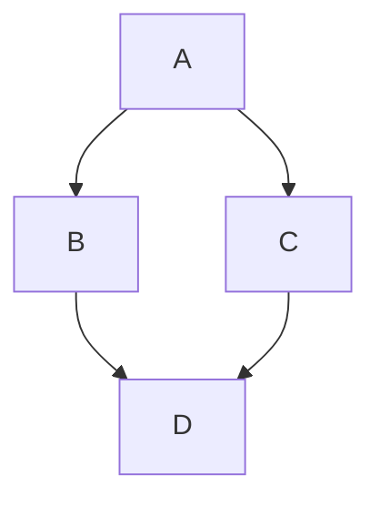

This file demonstrates using Mermaid diagrams.

This is an inline Mermaid document using a code fence with mermaid language

------------------

This is a Mermaid document read from a file, and rendered to a file

<diagrams-mermaid
        id="mermaid-sequence"
        alt="Mermaid sequence diagram example"
        title="Mermaid sequence diagram example"
        caption="Fig 2. Mermaid sequence diagram example"
        input-file='mermaid-example-sequence.mmd'
        output-file='mermaid-example-sequence.svg'/>

------------------

This is a Mermaid document read from a file, and rendered to a different file

<diagrams-mermaid
        id="mermaid-graph-different-file"
        alt="Mermaid graph rendered to different example"
        title="Mermaid graph rendered to different example"
        caption="Fig 3. Mermaid graph rendered to different example"
        input-file='mermaid-example-graph.mmd'
        output-file='mermaid-example-graph-different-file-name.svg'/>

-------------------

This is a Mermaid document read inline, and rendered to yet another file

<diagrams-mermaid
        id="mermaid-graph-inline"
        alt="Mermaid graph rendered inline to another file example"
        title="Mermaid graph rendered inline to another file example"
        caption="Fig 4. Mermaid graph rendered inline to another file example"
        output-file='mermaid-example-graph-yet-another-file-name.svg'>
graph TD;
    InlineMermaid-->SVGFile;
    SVGFile-->ReferredFromHTML;
</diagrams-mermaid>

-----------

This is a Mermaid document read inline, and rendered inline

<diagrams-mermaid
        id="mermaid-graph-inline"
        alt="Mermaid graph rendered inline viewed inline example"
        title="Mermaid graph rendered inline viewed inline example"
        caption="Fig 6. Mermaid graph rendered inline viewed inline example">
graph TD;
    InlineMermaid-->Buffer;
    Buffer-->InlineHTML;
</diagrams-mermaid>

