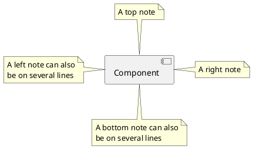

PlantUML inline code fence, outputs to inline SVG

----------------------

PlantUML input file, output to PNG

<diagrams-plantuml input-file="./puml-activity-diagram.puml"
    output-file="puml-activity-diagram.png" tpng/>

----------------------

PlantUML input file, output to SVG

<diagrams-plantuml input-file="./puml-activity-diagram.puml"
    output-file="puml-activity-diagram.svg" tsvg/>

----------------------

PlantUML input file, output to inline SVG

<diagrams-plantuml input-file="./puml-use-cases.puml" tsvg/>

----------------------

PlantUML input file, extremely wide, output to SVG file

<diagrams-plantuml input-file="./puml-wide-sequence-diagram.puml" 
    output-file="./puml-wide-sequence-diagram.svg" tsvg/>

----------------------

PlantUML input file, extremely wide, output to inline SVG

<diagrams-plantuml input-file="./puml-wide-sequence-diagram.puml" tsvg/>
