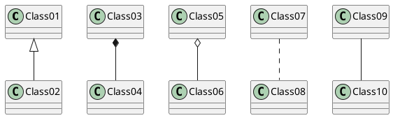
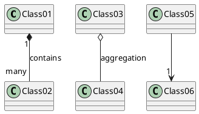
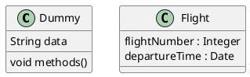
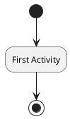
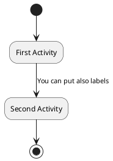
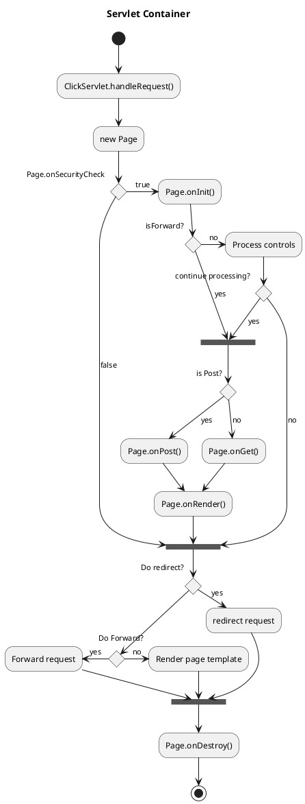
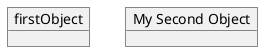

# Class diagrams

@startuml
Class01 <|-- Class02
Class03 *-- Class04
Class05 o-- Class06
Class07 .. Class08
Class09 -- Class10
@enduml

@startuml

Class01 "1" *-- "many" Class02 : contains

Class03 o-- Class04 : aggregation

Class05 --> "1" Class06

@enduml

@startuml
class Dummy {
  String data
  void methods()
}

class Flight {
   flightNumber : Integer
   departureTime : Date
}
@enduml

# Activity diagrams

@startuml
(*) --> "First Activity"
"First Activity" --> (*)
@enduml

@startuml
(*) --> "First Activity"
-->[You can put also labels] "Second Activity"
--> (*)
@enduml

@startuml
title Servlet Container

(*) --> "ClickServlet.handleRequest()"
--> "new Page"

if "Page.onSecurityCheck" then
  ->[true] "Page.onInit()"
  
  if "isForward?" then
   ->[no] "Process controls"
   
   if "continue processing?" then
	 -->[yes] ===RENDERING===
   else
	 -->[no] ===REDIRECT_CHECK===
   endif
   
  else
   -->[yes] ===RENDERING===
  endif
  
  if "is Post?" then
	-->[yes] "Page.onPost()"
	--> "Page.onRender()" as render
	--> ===REDIRECT_CHECK===
  else
	-->[no] "Page.onGet()"
	--> render
  endif
  
else
  -->[false] ===REDIRECT_CHECK===
endif

if "Do redirect?" then
 ->[yes] "redirect request"
 --> ==BEFORE_DESTROY===
else
 if "Do Forward?" then
  -left->[yes] "Forward request"
  --> ==BEFORE_DESTROY===
 else
  -right->[no] "Render page template"
  --> ==BEFORE_DESTROY===
 endif
endif

--> "Page.onDestroy()"
-->(*)
@enduml

# Object diagrams

@startuml
object firstObject
object "My Second Object" as o2
@enduml

